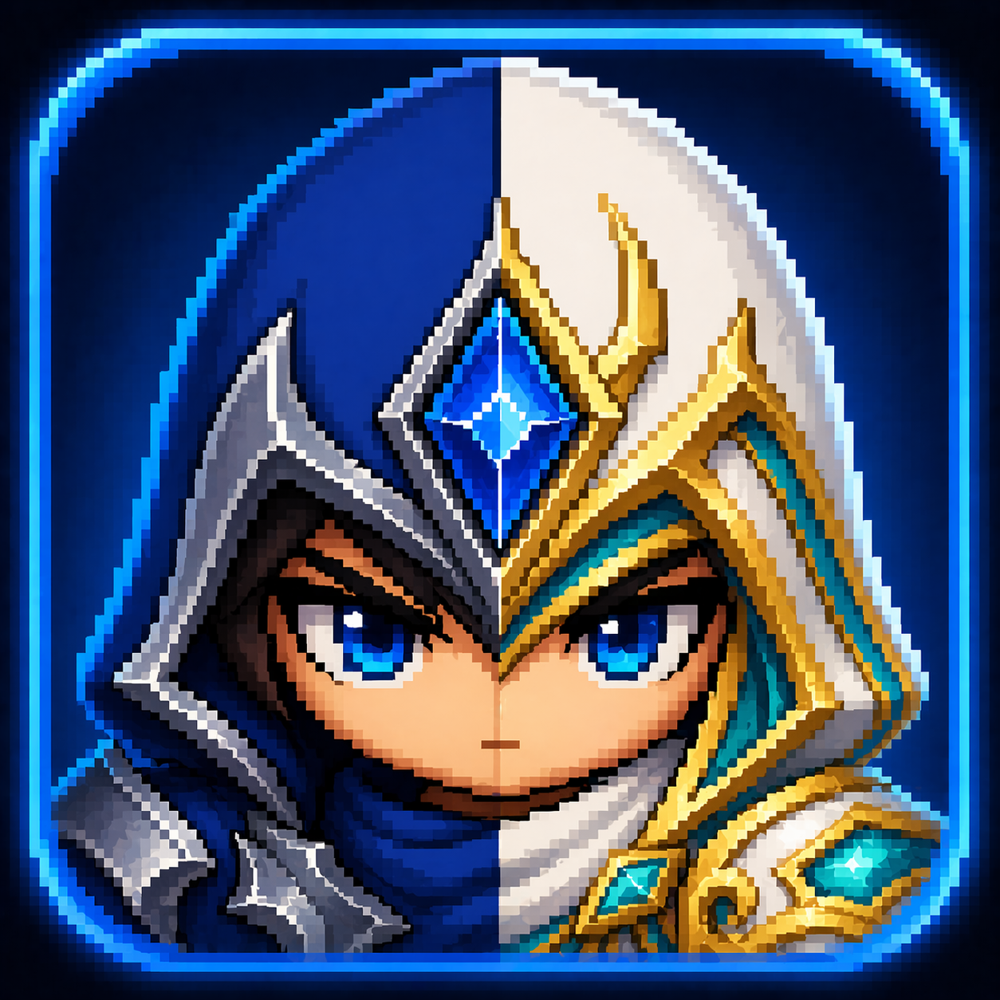

<p align="center">
  
</p>

<h1 align="center">Talon</h1>

<p align="center">
  A Windows desktop app for managing custom League of Legends skins.
</p>

<p align="center">
  
  
  
  
</p>

Talon is a Windows desktop app for managing custom League of Legends skins.
It focuses on a simple flow: import skins, manage a local library, preview what
you installed, and sync selected skins into the League client experience.

## Preview

```text
Import .fantome -> review generated previews -> enable skins -> launch League
```

## Features

- Import `.fantome` skins with a file picker or drag-and-drop.
- Build a local skin library with champion, author, version, and preview metadata.
- Enable or disable skins without touching the original imported files.
- Generate and cache splash, background, tile, and champion icon assets.
- Detect the League Client automatically through the LCU lockfile.
- Build an in-client skin index from imported skins and Data Dragon champion data.
- Clean up temporary overlay and runtime files on app exit.

## What Talon Does

Talon is built around the practical tasks involved in using custom skins day to
day:

- Keep all imported `.fantome` mods in one local library.
- Show useful metadata so you can identify skins quickly.
- Generate preview media so the library is easier to browse.
- Track which skins are enabled and disabled.
- Prepare the runtime overlay files needed for the League client.
- Integrate selected skins into the in-client carousel flow.

## Typical Workflow

1. Import one or more `.fantome` files.
2. Let Talon scan metadata and generate preview assets.
3. Review the library and enable the skins you want.
4. Launch or reconnect to the League Client.
5. Use the synchronized in-client skin data during champion select.

## Tech Stack

- Tauri 2
- Rust
- React 19
- TypeScript
- Vite
- Tailwind CSS v4
- shadcn/ui components using `@base-ui/react`
- pnpm

## Requirements

- Windows
- Node.js with Corepack enabled
- pnpm
- Rust stable
- Tauri prerequisites for Windows
- MSVC build tools for the native `core.dll` bridge build
- League of Legends installed

Enable pnpm through Corepack if needed:

```powershell
corepack enable
```

## Setup

Install dependencies:

```powershell
pnpm install
```

Run the app in development:

```powershell
pnpm tauri dev
```

Build the app:

```powershell
pnpm tauri build
```

During the Rust build, `src-tauri/build.rs` compiles the native CEF bridge and
emits `src-tauri/resources/core.dll`. That DLL is a generated build artifact and
is not committed to the repository.

The production bundle is written under:

```text
src-tauri/target/release/bundle/
```

## Useful Commands

```powershell
pnpm build
```

Builds the frontend only with TypeScript and Vite.

```powershell
cargo check --manifest-path src-tauri/Cargo.toml
```

Runs a fast Rust-only check without launching the desktop app.

```powershell
pnpm tauri icon icon.png
```

Regenerates the Tauri icon set from the root `icon.png`.

## App Data

Talon stores user data in the app data directory, usually:

```text
%APPDATA%\com.talon.app\
```

Important subdirectories:

```text
settings/                     User settings, including the League install path.
library/skins/                Imported .fantome skin files.
library/state.json            Enabled and disabled skin state.
library/skins_index.json      Generated in-game carousel index.
user-assets/backgrounds/      Custom user-selected background images.
user-assets/tiles/            Custom user-selected tile images.
cache/previews/               Generated preview assets.
cache/champion-icons/         Cached Data Dragon champion icons.
runtime/overlay/              Temporary overlay files.
```

## Project Structure

```text
src/                          React frontend.
src/components/ui/            Local UI primitives.
src-tauri/                    Tauri and Rust backend.
src-tauri/src/lcu/            League Client discovery and LCU polling.
src-tauri/src/skins/          .fantome parsing, library scan, previews, state.
src-tauri/src/overlay/        Overlay runtime and WAD handling.
src-tauri/src/pengu/          League client injection activation and cleanup.
src-tauri/src/wad/            WAD reading helpers.
src-tauri/resources/          Runtime DLLs and plugin assets bundled with Tauri.
src-tauri/icons/              Generated application icons.
scripts/                      Development helper scripts.
```

## Development Notes

- `src-tauri/tauri.conf.json` intentionally sets `dragDropEnabled` to `false`. This lets the webview receive normal HTML5 drag-and-drop events on Windows.
- Frontend edits hot-reload through Vite.
- Rust edits usually require the Tauri dev process to rebuild or restart.
- The LCU uses a self-signed localhost certificate, so the backend client explicitly accepts invalid certs for LCU calls.
- Runtime overlay and injection state are cleaned up when the app exits.

## Status

This project is actively evolving and targets Windows first. There is no automated test suite yet; use `pnpm build` and `cargo check --manifest-path src-tauri/Cargo.toml` as the baseline validation commands.
